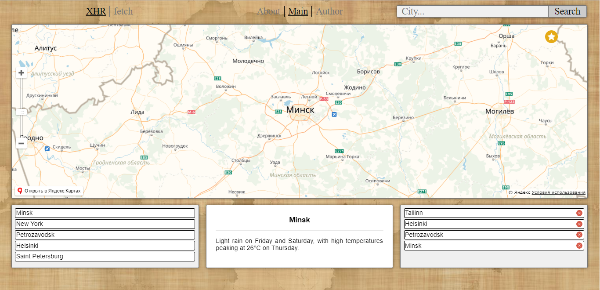

# Сайт "Прогноз погоды"

## Общая задача

Сайт состоит из трех блоков.

1. В шапке сайта находится форма с полем ввода и кнопкой `Search` и переключатель механизма запроса (два радиобаттона `XHR`/`fetch`) и меню, ведущее на другие страницы.
2. Центральная часть содержит информационное описание для главной страницы. И прогноз погоды для страницы конкретного города. В случае ошибки при запросе она отображает сообщение об ошибке
3. В подвале сайта отображаются 5 последних городов, погоду в которых искал пользователь. При ошибке запрос не добавляется в список

## Детали

* При вводе текста в поле ввода и нажатие кнопки `Enter` ( или по клику на кнопке `Search` ) пользователь попадает на страницу с прогнозом погоды в заданном городе. При этом страницу можно добавить в закладки или отправить сообщением - при открытии ссылки должен показаться тот же город.
* При изменении центра карты ( перетаскивание / зум ) должны отображаться данные по погоду для центра карты
* При поиске города он появляется верхним пунктом в списке последних запросов ( нижний блок ), остальные пункты опускаются на 1 вниз. Пункты с номером больше 5 исчезают.
* В любой точке на карте можно нажать 'Add to Favorites' - добавить точку с описанием в список `Favorites`. Из списка сущность можно удалить с помощью `x` возле записи. При клике на запись в списке "Избранное" происходит переход на сохраненные координаты
* Функция загрузки прогноза должна быть реализована в двух вариантах - с использованием fetch и с использованием XHR. Блок с options для выбора (два пункта из которых всегда выбран только один) какую из реализаций использовать для получения следующего прогноза.
* Для загрузки прогноза погоды использовать сайт https://darksky.net/
* Для получения координат по введенным данным использовать API Google Maps
* В шапке страницы находится меню с тремя пунктами: `About`/`Main`/`Author`
  Каждый пункт меню открывает соответствующую страницу.
  "Author" - Отображает статическую информацию - ваше имя, фото, ссылки на соцсети и свободный текст
  "Main" - при входе на страницу сайт определяет местоположение пользователя ( запросом на `https://ipinfo.io/geo` ) и перенаправляет на страницу с соответсвующими координатами
* Поддерживаться ссылки с указанием города ( например `/city&Minsk` )