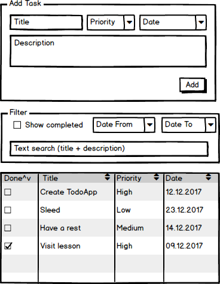

# Практика

## Todo App

Создать приложение **_Todo List_**

Реализовать приложение в отдельном репозитории. Заготовку создать с помощью
`create-react-app`.

Приложение состоих из трех частей

### Форма добавления задач

Позволяет добавить в список задачи. Поля задачи, доступные для заполнения (
обязательным является только заголовок ):

* Заголовок
* Описание
* Дата
* Приоритет (выпадающий список с больше, чем одним значением )

При добавлении задачи в список поля формы сбрасываются в начальное значение
(все, кроме даты).

### Фильтр для списка задач

Фильт регулирует то, какие задачи будут доступны в списке ниже. Фильтр позволяет
регулировать следующие настройки

* показывать ли выполненные задачи
* поиск по тексту ( регистронезависимый, поиск как в заголовке, так и в описании
  )
* фильтр по дате (минимальная и максимальная даты - заданы могут обе,
  одна-любая, ниодной)

Изменения на списке отражаются сразу при изменении полей в фильтре - при вводе
текста в фильтр, при изменении дат или состоянии чекбокса

### Список задач

Отображает список задач в виде таблицы. Заголовок таблицы содержит элементы
управления, позволяющие сортировать таблицу по колонке (в прямом и обратном
порядке)

## Теория

Пройти официальное руководство

* https://reactjs.org/tutorial/tutorial.html
* https://reactjs.org/docs/hello-world.html (Quck Start пройти, Advanced Guides
  просмотреть)

Полезным может оказаться

* https://www.gitbook.com/book/maxfarseer/react-course-ru/details
* https://abraxabra.ru/react.js/bystryy-start
* http://thewebland.net/react-js/
