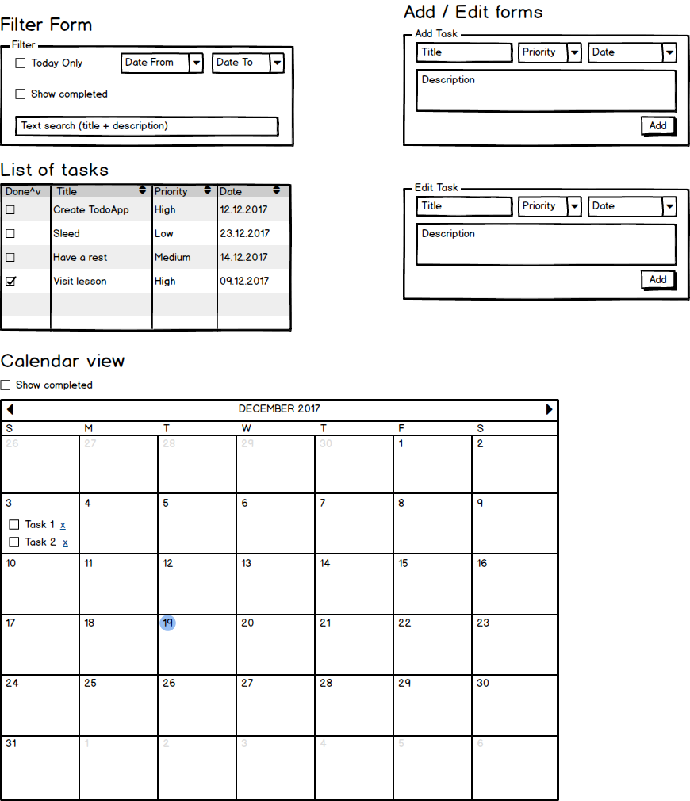

# Доработка TodoApp c использование Redux

Доработать приложение добавив в него

* redux (c поддержкой асинхронных операций)
* firebase (в качестве базы данных и провайдера авторизации)
* роутинг
* библиотеку UI компонентов (bootstrap/ semantic UI)

## Базовые блоки

Структурно приложение должно состоять из компонентов (см рисунок)

### Форма фильтра (Filter Form)

Позволяет задать параметры фильтрации отображаемых записей. Позволяет фильтровать по

* дате (конкретные даты, или только текущий день с помощью отдельного чекбокса)
* по флагу выполнения
* по тексту (поиск делается в поле заголовка и в поле описания)

### Форма добавления/редактирования (Add/Edit form)

Позволяет задавать значения полей при создании/редактировании записей

### Список задач (List of tasks)

Позволяет отображать список задач, подходящих под фильтр. Сортировать по возрастанию/убывания через кнопки в заголовке таблицы.

### Режим календаря (Calendar View)

Отображает задачи на календаре, позволяет фильтровать задачи по флагу выполнения (показывать или скрывать выполненные задачи)

** С помощью DranNDrop позволяет изменять даты для задач

## Работа с задачами

Страницы для работы с задачами имеют в шапке форму добавления задач.

На всех списках выполненные и невыполненные задачи отличаются либо иконкой, либо цветом блока.

Невыполненные задачи можно редактировать (двойное нажатие по элементу открывает модальное окно редактирования) и удалять (с запросом подтверждения от пользователя). Выполненные задачи измененять нельзя (либо сначала нужно снять флаг выполнения).

## Страницы

Приложение имеет основное меню в шапке страницы, ведущее на три основных страницы

* Календарный вид
* Список задач
* О проекте

Изменения фильтров на страницах с задачами должно отображаться на URL адрес, чтобы при обновлении или передаче ссылки состояние фильтров было восстановлено.

## Firebase

Для авторизации и хранения данных использовать сервис Firebase. Работа со страницами кроме `About` доступна только после авторизации. Данные разных пользователей должны храниться раздельно (данные пользователя А недоступны пользователю B).

## Ссылки:

Redux:

 * https://www.gitbook.com/book/rajdee/redux-in-russian
 * https://github.com/vvscode/js--redux-info
 * https://www.gitbook.com/@maxfarseer/

Firebase:

* https://firebase.googleblog.com/2016/01/keeping-our-promises-and-callbacks_76.html
* https://firebase.google.com/docs/web/setup
* https://www.youtube.com/watch?v=GnORwtq1_1A
* https://codelabs.developers.google.com/codelabs/firebase-web-ru/index.html?index=..%2F..%2Flang-ru#0
* https://firebase-info.com/category/firebase/
* Репозиторий с примерами https://github.com/firebase/quickstart-js

## Процесс разработки

Процесс разработки разбит на три этапа

* изучение Firebase и разработка API для работы с его хранилищем
* разработка приложения с хранением данных в localStorage
* объединение firebase и разработанного приложения

Каждый студент выполняет все три части. Часть 3 он выполняет используя код двух других студентов (часть 1 + часть 2)
