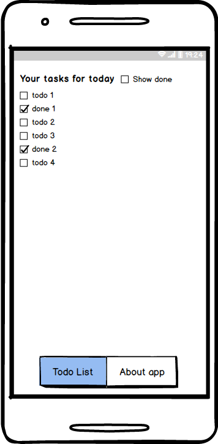

## Мобильный список дел

Создать мобильное приложение на базе [react-native](http://reactnativedocs.ru/docs/getting-started.html).

Приложение состоит из двух экранов:

* About с описанием приложения и достоинств автора
* TodoList со списком задач на сегодняшний день, отсортированным по степени важности

Список задач доступен только после авторизации.

Авторизацию и хранение реализовать на базе FireBase. Для решения задачи можно подключать сторонние пакеты.

На странице со списков задач можно включать и отключать отображение выполненных задач. Добавление задач в список не обязательное условие. Главное - отображение списка и изменение статуса задачи
